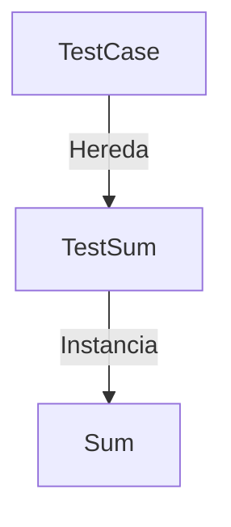

# FirstExample

Primer ejemplo de pruebas unitarias con JUnit. El objetivo es tener la visibilidad técnica de como hacer una prueba initaria en una clase de Java.

# Files

[src]
   \--[com.decameron.logic]
	   \---[Sum.java]
   \--[com.decameron.testcase]
   	   \---[TestSum.java]

## Diagrama De Clases

